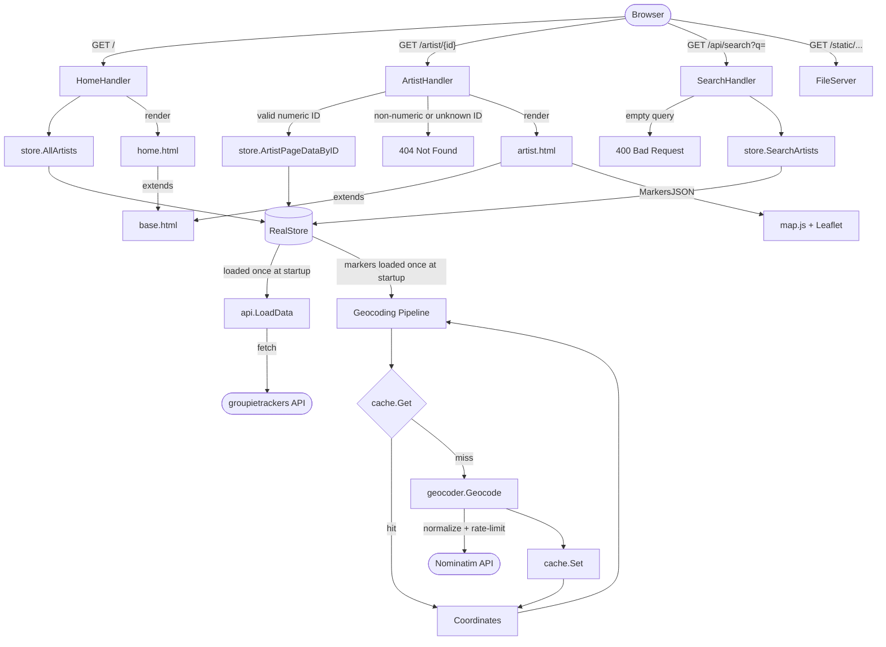
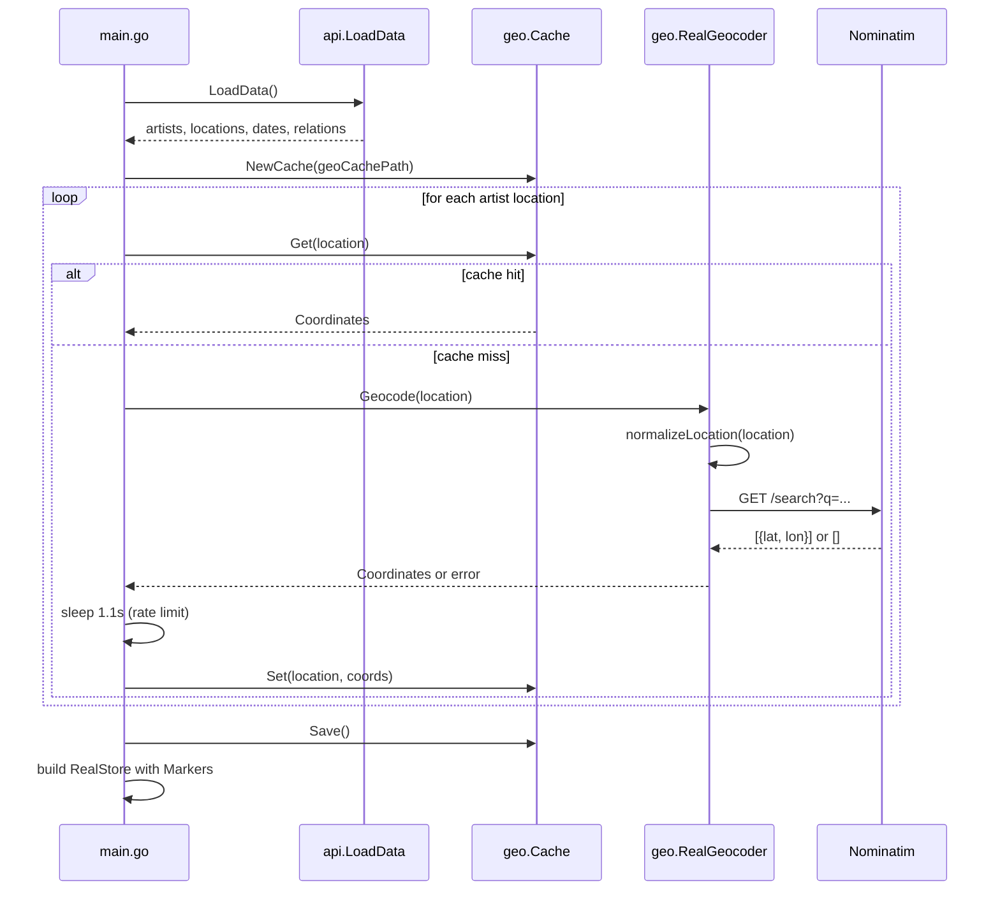
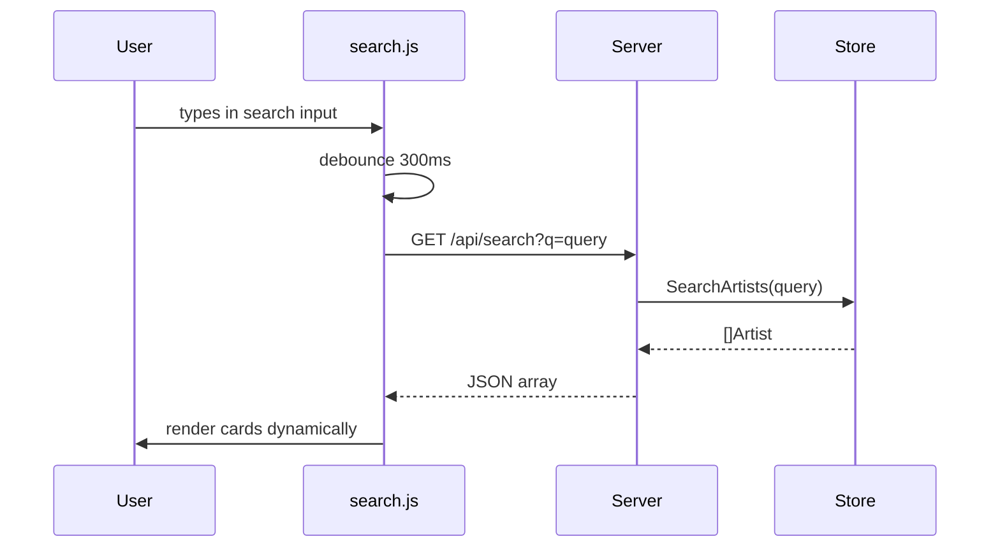

# Diagrams

## Application Flow

```mermaid
flowchart TD
    A([Browser]) -->|GET /| B[HomeHandler]
    A -->|"GET /artist/{id}"| C[ArtistHandler]
    A -->|"GET /api/search?q="| D[SearchHandler]
    A -->|"GET /static/..."| E[FileServer]

    B --> F[store.AllArtists]
    C -->|valid numeric ID| G[store.ArtistPageDataByID]
    C -->|non-numeric or unknown ID| Q[404 Not Found]
    D -->|empty query| P[400 Bad Request]
    D --> H[store.SearchArtists]

    F --> I[(RealStore)]
    G --> I
    H --> I

    I -->|loaded once at startup| J[api.LoadData]
    J -->|fetch| K([groupietrackers API])

    I -->|markers loaded once at startup| R[Geocoding Pipeline]
    R --> S{cache.Get}
    S -->|hit| T[Coordinates]
    S -->|miss| U[geocoder.Geocode]
    U -->|normalize + rate-limit| V([Nominatim API])
    U --> W[cache.Set]
    W --> T
    T --> R

    B -->|render| L[home.html]
    C -->|render| M[artist.html]

    L -->|extends| N[base.html]
    M -->|extends| N

    M -->|MarkersJSON| X[map.js + Leaflet]
```

## Startup Lifecycle — Geocoding

```mermaid
sequenceDiagram
    participant M as main.go
    participant API as api.LoadData
    participant C as geo.Cache
    participant G as geo.RealGeocoder
    participant N as Nominatim

    M->>API: LoadData()
    API-->>M: artists, locations, dates, relations
    M->>C: NewCache(geoCachePath)
    loop for each artist location
        M->>C: Get(location)
        alt cache hit
            C-->>M: Coordinates
        else cache miss
            M->>G: Geocode(location)
            G->>G: normalizeLocation(location)
            G->>N: GET /search?q=...
            N-->>G: [{lat, lon}] or []
            G-->>M: Coordinates or error
            M->>M: sleep 1.1s (rate limit)
            M->>C: Set(location, coords)
        end
    end
    M->>C: Save()
    M->>M: build RealStore with Markers
```

## Request Lifecycle — Live Search

```mermaid
sequenceDiagram
    participant U as User
    participant JS as search.js
    participant S as Server
    participant ST as Store

    U->>JS: types in search input
    JS->>JS: debounce 300ms
    JS->>S: GET /api/search?q=query
    S->>ST: SearchArtists(query)
    ST-->>S: []Artist
    S-->>JS: JSON array
    JS->>U: render cards dynamically
```