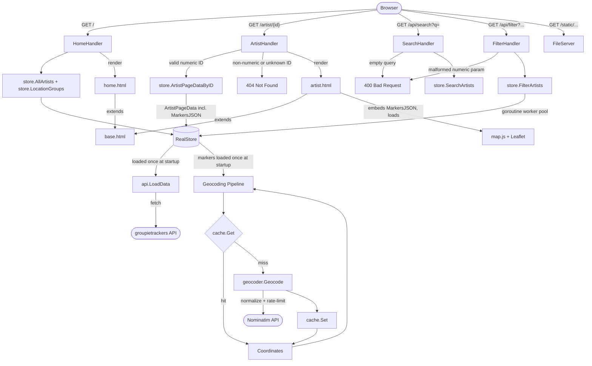
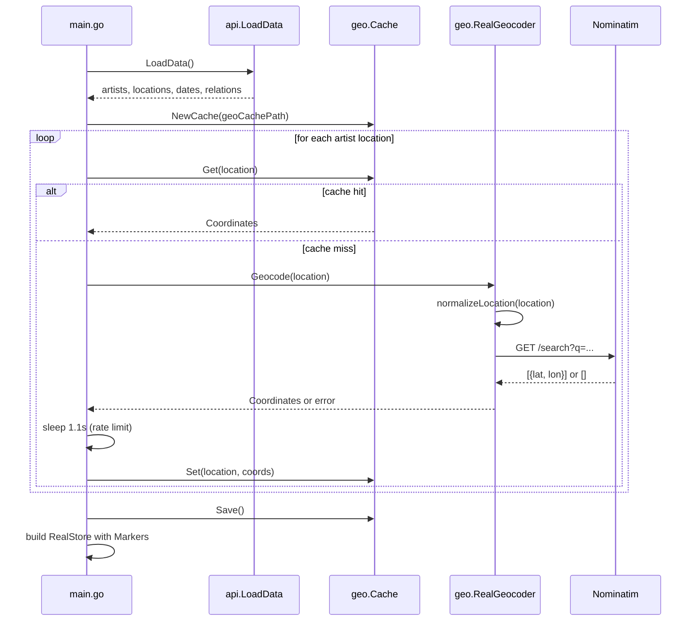
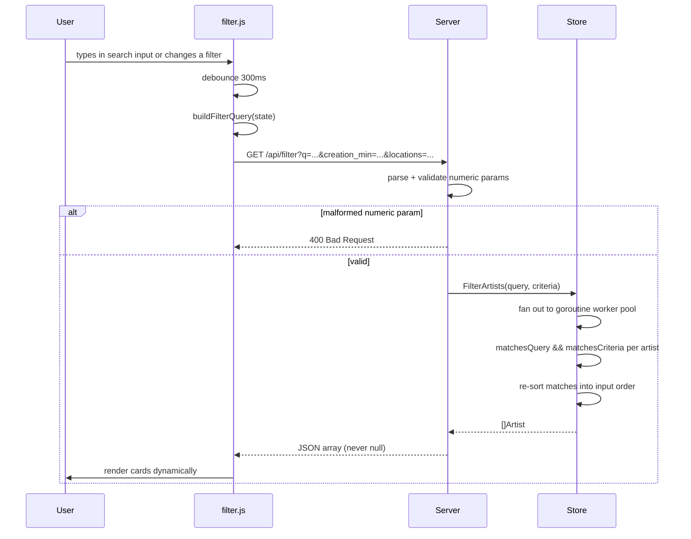

# Diagrams

## Application Flow

## Startup Lifecycle — Geocoding

## Request Lifecycle — Search & Filter

`search.js` no longer calls `/api/search` on its own — `filter.js` owns
`#search-results` and reads the search box alongside the filter panel inputs,
combining both into a single `/api/filter` request with logical AND.

